## Track 1: Intelligent Recommendation System

## Project Overview

This project is an Inference Engine built to transform raw classroom data into actionable educational insights. Unlike standard gradebooks, this system uses Relative Benchmarking and Weighted Risk Scoring to identify students who are underperforming or showing "Sudden Dips," allowing for early teacher intervention.

## Key Intelligence Features

•	Dynamic Risk Weighting: Allows educators to prioritize different indicators (Attendance vs. Academic History vs. Current Quiz) based on the subjects needs.

•	Relative Mean Benchmarking: Categorizes students not against a static "pass" mark, but against the Class Average, identifying those falling behind their peers.

•	The 4-Quadrant Matrix: Automatically sorts students into:
o	High Flyers: High history & High current performance.

o	Sudden Dip: High history but low current performance (The "Anomaly" group).

o	The Climbers: Low history but showing recent improvement.

o	Critical Support: Low history and low current performance.

•	Anomaly Detection: A specialized trigger that flags any student whose latest quiz score drops by more than 15% compared to their historical average.

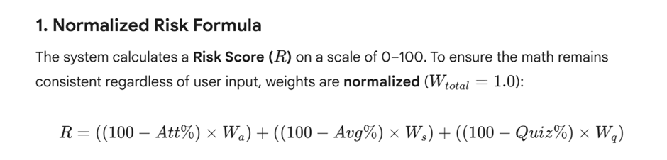

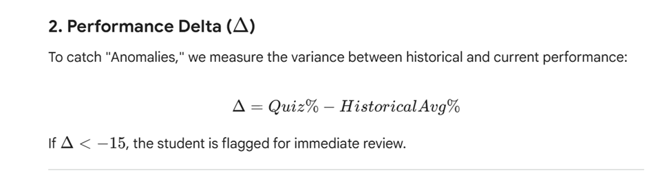

## Analytical Logic 

1. 15% Anomaly Threshold:
In this dashboard, an Academic Anomaly is triggered if a student's current Quiz Score drops by 15% or more compared to their Historical Average.

•	Statistical Significance: A 5% or 10% fluctuation is often "noise" ( a single difficult question). A 15% drop represents a significant shift in performance,typically a two-grade boundary jump (e.g., from an A to a C).

•	Actionable Alerts: By setting the threshold at 15%, the system filters out minor variances and only alerts the educator when a student is showing signs of a deeper struggle or a lack of prerequisite knowledge for the current topic.

•	Early Intervention: This logic catches the "Sudden Dip" student,someone who has high historical grades but is failing now before their overall CGPA is permanently damaged.

## 2.  The Significance of User-Changeable Parameters:
The sidebar allows users to adjust Risk Weights (Attendance, History, Quiz) and the Performance Benchmark. This makes the tool flexible.
•	Lead vs. Lag Indicators: * Attendance is a Lead Indicator (predicts future failure).

o	Quiz Scores are Current Indicators (shows immediate struggle).

o	Historical Avg is a Lag Indicator (shows long-term patterns).

•	Contextual Tuning: * In a Vocational Workshop, a teacher might set Attendance Weight to 0.7 because physical presence is the primary driver of success.
o	In a Theoretical Physics course, a teacher might set Quiz Weight to 0.8 to focus strictly on the mastery of complex new concepts.

•	The Normalized Formula: To ensure mathematical integrity, the system auto-normalizes these weights so they always sum to 1.0, keeping the Risk Score accurately bounded between  0 and 100

## 3.  Relative Benchmarking :

Unlike traditional systems that use a fixed "35% to pass" rule, this engine calculates risk relative to the Class Mean .

•	Difficulty Sensing: If a quiz was exceptionally hard and the entire class averaged 40%, a student scoring 45% is technically a "High Flyer" in that context.

•	Fairness: This prevents the system from flagging the entire class as "At Risk" during a difficult unit and instead highlights the individuals who are truly falling behind their peers.

**Visualizations & Metrics**

•	Visual Risk Map (Scatter Plot): Maps Attendance (X) vs. Quiz Score (Y), where bubble size represents the calculated Risk Score.

•	KPI Tiles: Real-time metrics comparing the Class Average against a user-defined Benchmark.

•	Risk Distribution: A ranked bar chart identifying the priority list for teacher intervention.

## Installation & Setup

**1.	Clone the Repository:**

   
git clone https://github.com/SrihitaT/Intelligent_Recommendation_System

cd student-analytics-dashboard

**3.	Install Requirements:** 

pip install streamlit

pip install pandas

pip install numpy

**5.	Run the Application:**
   
streamlit run main.py

## Testing

This project includes a standalone test_cases.py file to validate the mathematical engine. It tests:
1.	Weight Sensitivity: Ensuring risk scales correctly when weights are shifted.
2.	Anomaly Logic: Verifying the 15% drop trigger.
3.	Quadrant Mapping: Confirming students are correctly assigned based on class means.

**To run the tests:**

python test_cases.py

## Project Structure
•	main.py: Main Streamlit application and UI logic.

•	test_cases.py: Unit tests for the intelligence engine.

•	requirements.txt: List of dependencies.

•	README.md: Project documentation.

## Dashboard Preview

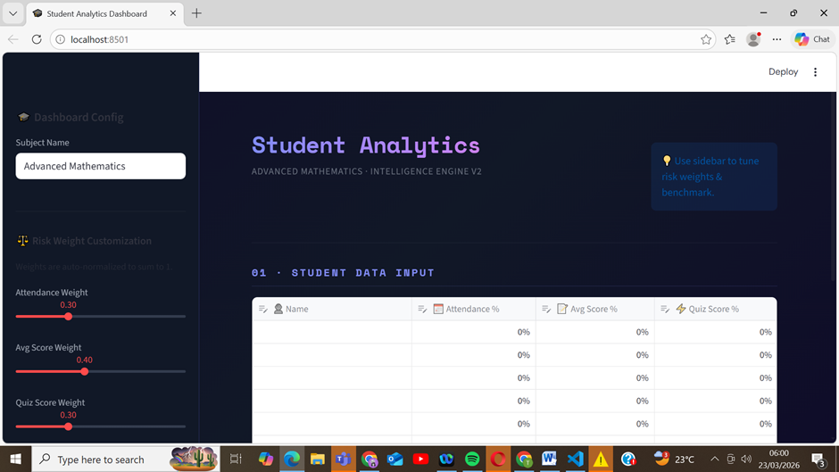

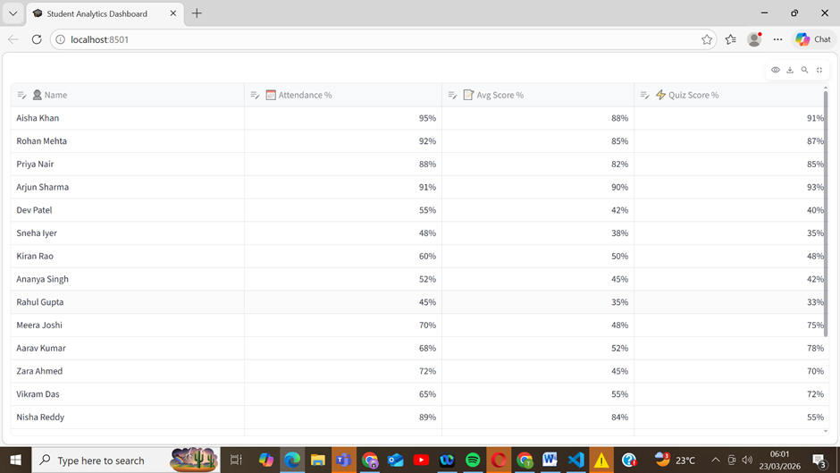
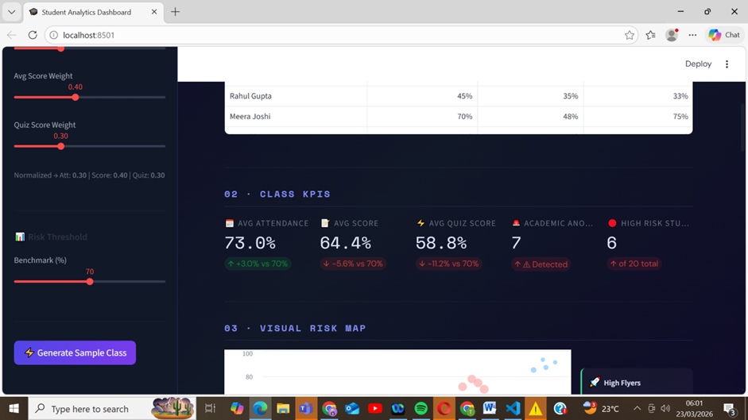

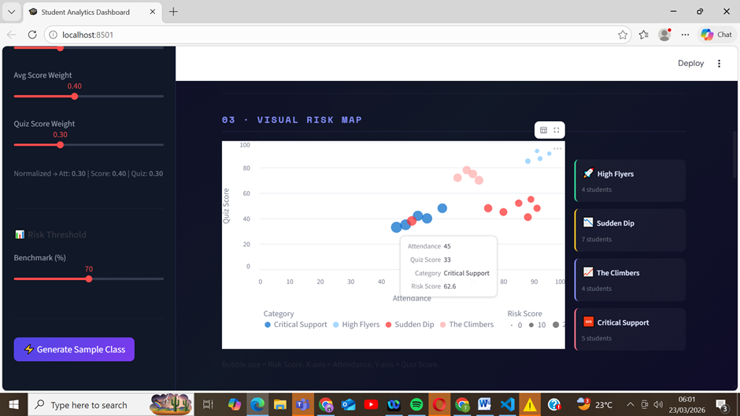

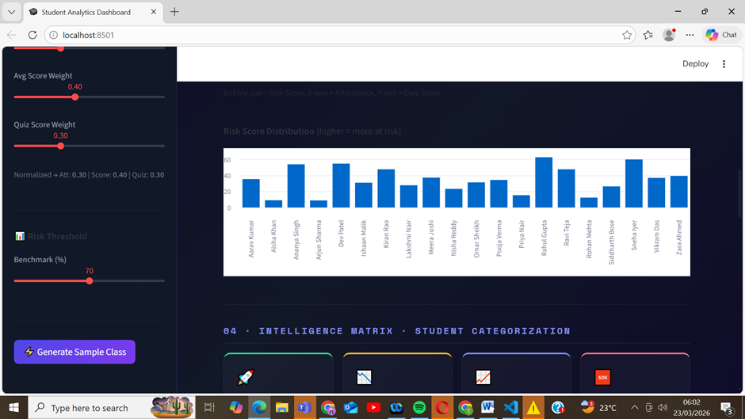

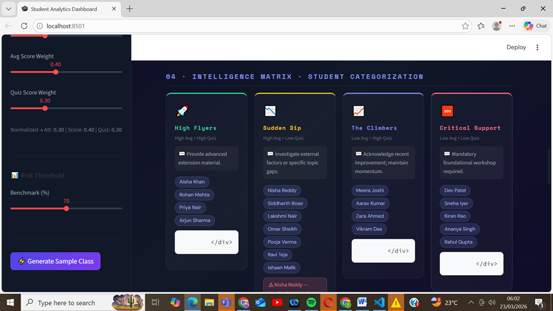

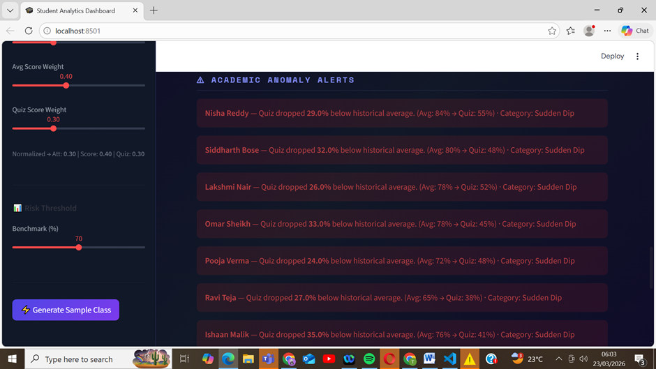

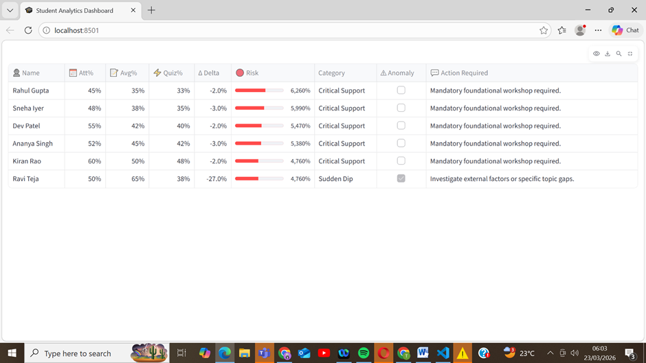

## test_cases.py:

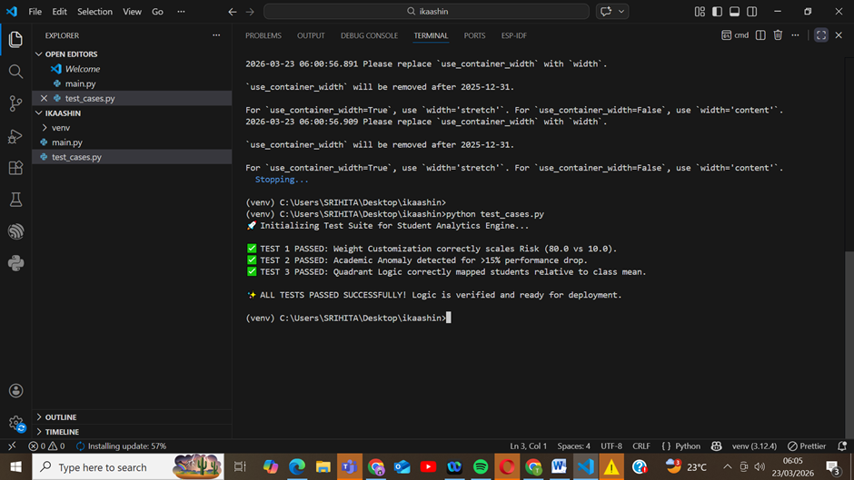
